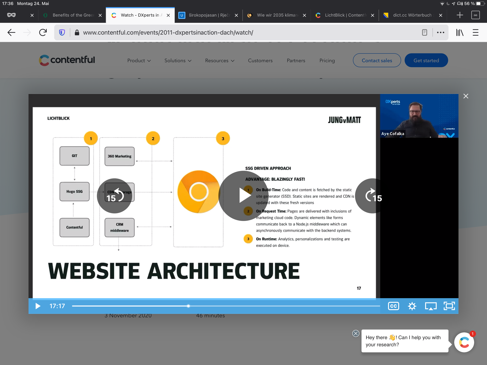
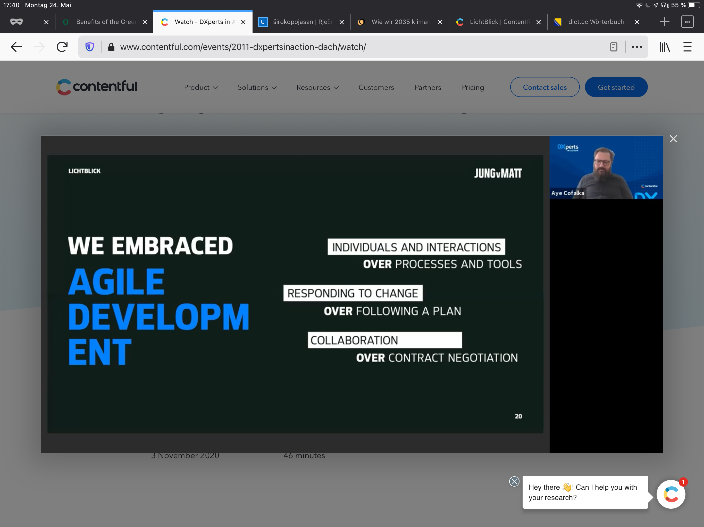
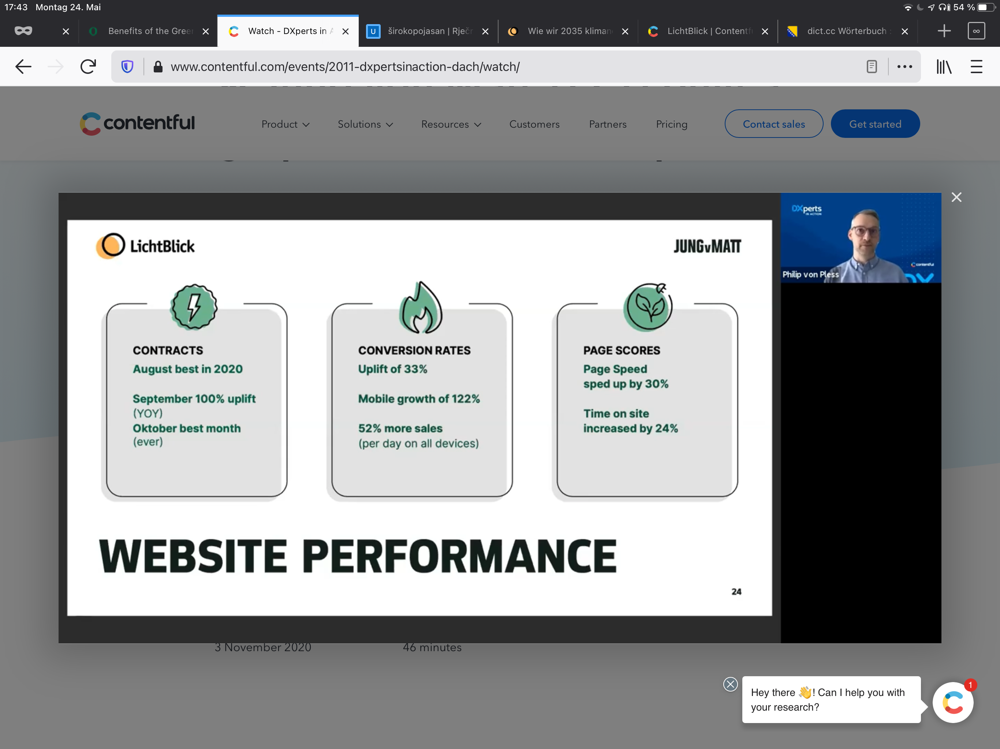

#

Präsentation: [Content Management Systeme—Neue Trends](https://heinzwittenbrink.github.io/slides-headless/#/title-slide "Content Management Systeme—Neue Trends")

Text: <https://github.com/heinzwittenbrink/slides-headless/blob/main/headless.md>

# Themen/Stichwörter

- Craft CML
- Headless CMS
- Static Site Generator
- Content Modelling
- Wie hängt das zusammen?

# Content als eigenes Layer

- Traditionell: Content als Teil einer Publikation
- Verschiedene Zugriffe auf Inhalte
- Agiles Entwickeln von Inhalten und Anwendungen

::: notes

Ich möchte heute kurz einiges über neue Entwicklungen bei Content Management Systemen erzählen. Zwar verwenden die meisten Websites heute noch Systeme wie Wordpress und Typo 3, also das, was wir als CMS kennen. Aber seit etwa 10 Jahren hat sich die Welt der Content Management Systeme deutlich verändert. Das wichtigste Stichwort oder Buzzword heisst dabei *headless*. Gemeint ist damit, dass der Prozess der dynamischen Seiten-Generierung, wie wir ihn von den traditionellen Content Management Systemen kennen, nicht mehr bestimmt, wie ein Content Management System organisiert ist. Content Management Systeme sind für den Content zuständig, aber nicht mehr dafür, wie dieser Inhalt weiterverarbeitet und publiziert wird.

:::

# Craft CMS

Beispiel: [Content Strategy](https://oer.putyourlightson.dev/ "Content Strategy EN")

Admin-Interface: [Entries - Content Strategy](https://oer.putyourlightson.dev/admin/entries/lectureReports "Entries - Content Strategy")

# Headless

Warum man von einem Headless CMS spricht, erklärt ganz kurz dieses Video:

[Headless CMS explained in 2 minutes - YouTube](https://www.youtube.com/watch?v=-Uor3I0n_vQ)

# Content Modelling

- Inhalt muss unabhängig von Seiten (oder Websites) strukturiert werden.
- *Content Model*: Struktur der Inhalte insgesamt
- *Content Type*: Struktur einer bestimmten Art von Inhalten

::: notes

Durch die Headless CMS ist ein Aspekt des Content Managements in den Vordergrund gerückt, der bisher oft dadurch verdeckt war, dass die Inhalte in einem CMS Seiten zugeordnet waren. Wenn die Seite die grundlegende Einheit für die Inhalte ist, dann muss man sich nicht unbedingt um eine zusätzliche formale Struktur bemühen. Wenn aber der Inhalt von Seiten unabhängig ist, wie z.B. bei Single Page-Applikationen, dann muss die inhaltliche Struktur für sich definiert werden.

:::

# Content Modelling in modernen CMS

[Structures of Content \- Storyblok](https://www.storyblok.com/docs/guide/essentials/content-structures)

<https://craftcms.com/docs/getting-started-tutorial/configure/modeling.html#get-familiar-with-content-modeling-in-craft>

# Wo wird der Inhalt publiziert

- Traditionelle Websites
- Single Page Apps
- Progressive Web Apps
- IOS-/Android Apps
- Alexa Skill ...

::: notes

Wenn der Inhalt so strukturiert vorliegt und zugänglich ist, dann kann völlig unterschiedlich publizieret werden, und man kann verschiedene Publikationsmöglichkeiten kombinieren und sie auch schnell wechseln oder weiterentwickeln. Inhalte sind Komponenten von Applikationen, die sehr unterschiedlich Funktionen haben können.

Es kann sein, dass derselbe Inhalt für manche Clients serverseitig gerendert wird, und dass bei anderen der Client für das Rendering zuständig ist. Es kann auch beides miteinander verbunden sein, und es können in die Inhalte Komponenten aus anderen Quellen integriert sein. Genau dafür passt das Modell eines monolithischen System nicht.

:::

# SSGs

 aus [What's the Difference between Headless CMS and Static Site Generator? \| Agility CMS](https://agilitycms.com/resources/posts/what-s-the-difference-between-headless-cms-and-static-site-generator){width="30%"}

#

- Seiten werden zusammen produziert und als Verzeichnis auf den Web Server gestellt
- Performance Vorteile
- Flexibilität durch Templating Engines

# Beispiel SSGs

- [Eleventy is a simpler static site generator.](https://www.11ty.dev/ "Eleventy is a simpler static site generator.")
- Lokale Files
- Github: [heinzwittenbrink/offgallery_at](https://github.com/heinzwittenbrink/offgallery_at "heinzwittenbrink/offgallery_at: For the development of the website of the offgallery graz - and for learning eleventy and related stuff")
- Publikation via Netlify: [Team overview | Heinz Wittenbrink's team](https://app.netlify.com/teams/heinzwittenbrink/overview "Team overview | Heinz Wittenbrink's team")

# Single Page Apps

- Vorbild Mobile Applikationen
- Erzeugung meist mit Javascript-Frameworks
- Server- und Clientseitiges Rendering als Optionen
- Beispiel: [ReactJS serverseitiges Rendering vs. clientseitiges Rendering](https://qastack.com.de/programming/27290354/reactjs-server-side-rendering-vs-client-side-rendering "ReactJS serverseitiges Rendering vs. clientseitiges Rendering")

# APIs für Inhalte

- **A**pplication **P**rogramming **I**nterfaces
- Zugriff durch beliebige Applikationen
- Lose Kopplung von Inhalten und Funktionalitäten

# REST APIs

- Zugriff auf Inhalte über HTTP
- Webtypische, offene Schnittstelle

# GraphQl APIs

- Beschreibung der Inhalten
- Minimierung von HTTP-Zugriffen
- [GraphQL | A query language for your API](https://graphql.org/ "GraphQL | A query language for your API")

# Beispiel Contentful/LichtBlick

[LichtBlick | Contentful](https://www.contentful.com/case-studies/lichtblick/ "LichtBlick | Contentful")

Video: <https://www.contentful.com/events/2011-dxpertsinaction-dach/watch/>

#

- Content as code
- Static site generator for static content
- React for dynamic content, both possible by API access
- Main reasons for choice: scalability and flexibility
- Keine on premises Systeme mehr

#

#

#

#  Headless CMS für News-Organisationen:

[Superdesk Essentials: Welcome to Superdesk, Your New Digital Newsroom - YouTube](https://www.youtube.com/watch?v=MQ09P2Fz4Io "(279) Superdesk Essentials: Welcome to Superdesk, Your New Digital Newsroom - YouTube")
